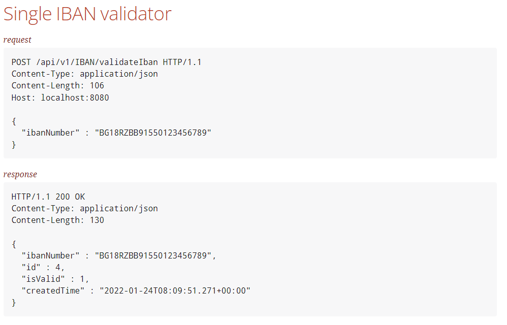

# Spring Boot IBAN validator Project

#### This is a simple IBAN number validator project which is written in Java / Maven / Spring Boot / Vue and used Swagger / H2 Database / Docker.

## How to Run

This application is packaged as a jar and a war. You can run it using the ```java -jar``` command.

- Clone this repository
- Make sure you ar using at least JDK 11 and Maven 3.x
- You can build the project and run the tests by running ```mvn package spring-boot:repackage```
- Once successfully built, you can run the application by this methods:
```
java -jar target/IBANChecker-0.0.1-SNAPSHOT.jar  
```
Once the application runs you should see something like this
```
2022-01-24 09:47:36.173  INFO 9912 --- [           main] o.s.b.w.embedded.tomcat.TomcatWebServer  : Tomcat started on port(s): 8080 (http) with context path ''
2022-01-24 09:47:36.197  INFO 9912 --- [           main] c.h.ibanchecker.IbanCheckerApplication   : Started IbanCheckerApplication in 13.349 seconds (JVM running for 14.851)
```

## About the Service

The application is just a simple IBAN validator REST service and frontends. 
It uses an in-memory database (H2) to store the data. You can also do with a relational database like MySQL or PostgreSQL. 

We have 3 methods:




### To view Swagger API docs

Run the server and browse to http://localhost:8080/swagger

## Dockerization

I have created docker image and this project can run in docker container.

Build docker image:
```
docker build -t hometask:latest .
```

Run latest image on container:

```
docker run hometask:latest
```